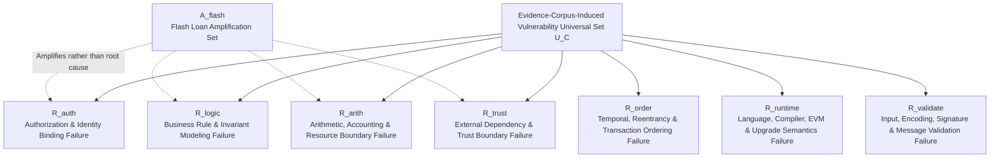
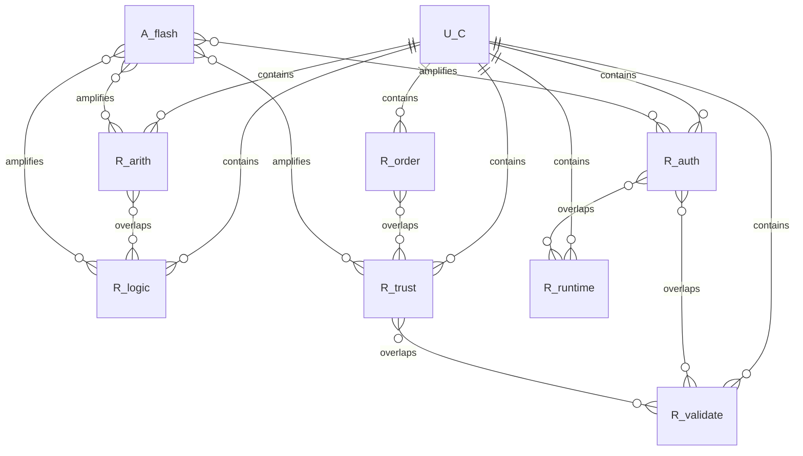

# Root Cause Set Analysis of Blockchain Smart Contract System Vulnerabilities

## Executive Summary

This article rigorously models "smart contract vulnerabilities" as an **evidence-corpus-induced universal set** $U_C$, rather than an inexhaustible open-world universal set $U^*$. This definition is motivated by OWASP SCWE's explicit distinction between *weakness* (a condition that, under certain circumstances, can lead to a vulnerability) and *vulnerability* (an exploitable defect that leads to undesirable security consequences); EIP-1470 likewise defines a vulnerability as one or more weaknesses causing a smart contract system to enter an undesired state. Building on this, this article unifies into $U_C$ the "vulnerability samples or exploit-enabling weakness instances" that are reducible to contract-system security failures from OWASP Top 10 2026, OWASP SCWE v1.0, SWC/EIP-1470, academic papers, and NVD/CVE. This approach preserves engineering verifiability while aligning with the NIST Bugs Framework's formalized understanding of vulnerabilities as "weakness chains."

Over this universal set, I propose a **seven-subset root cause cover**:
$R_{\text{auth}}$ Authorization & Identity Binding Failure, $R_{\text{logic}}$ Business Rule & Invariant Modeling Failure, $R_{\text{order}}$ Temporal/Reentrancy/Ordering Failure, $R_{\text{arith}}$ Arithmetic/Accounting/Resource Boundary Failure, $R_{\text{trust}}$ External Dependency & Trust Boundary Failure, $R_{\text{runtime}}$ Language/Compiler/EVM/Upgrade Semantics Failure, $R_{\text{validate}}$ Input/Encoding/Signature/Message Validation Failure. Each root cause is formalized as a predicate $P_i(v)$, corresponding to subset $R_i=\{v\in U_C\mid P_i(v)\}$. These subsets are **not a partition**, because real-world vulnerabilities typically involve overlapping causes; however, they constitute a **cover**: $\bigcup_i R_i = U_C$. Additionally, I treat flash loans separately as an **amplification operator** $A_{\text{flash}}$, rather than a native root cause; this is consistent with OWASP 2026's characterization of flash loans — "not a vulnerability per se, but an attack tool that amplifies underlying weaknesses" — as well as with the "exploit chains" perspective advanced in the 2025 SoK on real-world attacks.

Three conclusions carry the greatest weight for engineering practice. First, **the highest-frequency and highest-severity root causes are not merely classic code bugs**. OWASP 2026's incident-based ranking elevates access control, business logic, oracle manipulation, and proxy/upgradeability to the top tiers; 2025 incident data likewise shows that Business Logic and Access Control exhibit extremely high frequency and loss magnitude. Second, **smart contract root causes must be understood beyond "code syntax errors"**: academic surveys have already expanded root cause scope to authentication/authorization, external dependencies, language/toolchain, and Ethereum design/implementation, while the real-world SoK further elevates root causes to four layers — protocol logic, lifecycle/governance, external dependencies, and classic vulnerabilities. Third, **current automated tool coverage is highly uneven**: static analysis, symbolic execution, and fuzzing are effective for reentrancy, integer errors, and similar patterns, but coverage is insufficient for real-world protocol logic, governance, cross-protocol dependencies, and exploit chains; existing research has even found that automated tools hit far fewer high-impact real-world attacks than expected.

A preliminary caveat: the **scope** of this article focuses on **EVM smart contract systems on public blockchains**, defaulting to Solidity while also considering EVM-related languages/compilers (e.g., Vyper, Yul, L2 compilers) and EVM-compatible chains; for non-EVM platforms, only "conservative notes on similar root causes" are provided, without equivalent-strength formal induction. NIST defines a smart contract as a collection of code and data on a blockchain, explicitly noting that not all blockchains run smart contracts; OWASP 2026, in entries on reentrancy, flash loans, and upgrade mechanisms, repeatedly notes that non-EVM chains exhibit **analogous patterns**.

## Scope, Assumptions, and Methodology

### Scope and Assumptions

The subject of this article is contract systems on **public smart contract platforms**, with core samples drawn from Ethereum and EVM-compatible chains. The default language is Solidity, because the EEA EthTrust certification specification is "written for Solidity smart contracts"; additionally, toolchain and language-layer samples include known compiler/platform bugs listed in the official Solidity documentation, as well as NVD entries directly mappable to EVM language or compiler issues, such as Vyper `_abi_decode`, OpenZeppelin `SignatureChecker`, and ZKsync Yul evaluation-order defects.

Regarding the threat model, this article assumes that an attacker can interact with the system as any external caller, malicious contract, governance participant, ordering participant within miner/builder-permitted bounds, or an incorrectly trusted oracle/bridge/token/external protocol; however, this article **does not** incorporate purely off-chain or non-contract vectors — such as phishing, private key theft, exchange hacks, malicious interviews, or supply-chain social engineering — into $U_C$. This boundary is consistent with OWASP 2026 treating "Beyond Smart Contracts: Alternate Top 15 Web3 Attack Vectors" as a separate list.

For non-EVM platforms, this article does not claim that the "seven root cause sets" have been equally validated. OWASP 2026 notes, in items on flash loans, reentrancy, and proxy/upgradeability, that non-EVM chains possess **corresponding concepts**, such as single-batch short-term large positions, cross-program recursion, and program upgrade privileges; however, these platforms differ in execution model, resource model, and type system, so this article treats them only as **extrapolative notes** rather than primary conclusions.

### Source Priority

I determine source priority according to the following table, and accordingly decide which sources to use for definitions, which for supplementary samples, and which for illustrations.

| Priority Tier | Primary Sources | Usage in This Article | Remarks |
|---|---|---|---|
| Standards & Official Baselines | OWASP Smart Contract Top 10 2026, SCWE v1.0, SCSTG, Solidity Official Documentation, EEA EthTrust, NIST IR 8202, NIST SP 800-231, NVD/CVE | Define vulnerability/weakness terminology, current mainstream risk categories, EVM official security semantics, testing methodology, vulnerability formalization background | OWASP 2026 explicitly provides rankings based on 2025 incidents and practitioner surveys; SCWE explicitly distinguishes weakness/vulnerability; the SWC official page declares its content has not been actively maintained since 2020 and advises referring to EthTrust/SCSVS. |
| Academic Surveys & SoKs | Atzei 2017, ZEUS 2018, MAIAN 2018, Sereum 2019, Chen 2020, Khan & Namin 2020, Chu 2023, Rezaei 2025 | Extract root cause layering, coverage arguments, tool capability boundaries, exploit chains in real attacks | Chen 2020 extends root causes to authentication/authorization, external dependencies, Solidity/toolchain, and Ethereum design/implementation; Rezaei 2025 abstracts four layers: protocol logic, lifecycle/governance, external dependencies, and classic vulnerabilities. |
| Industry Frontline Security Practice | Trail of Bits, ConsenSys Diligence, ethereum.org's Trail of Bits Token Integration Checklist | Supplement reviewer/developer practices for each root cause category, specific defense recommendations for upgradeability/proxy/external token integration, etc. | Trail of Bits particularly emphasizes the complexity and risk introduced by upgradeability/`delegatecall`; ConsenSys emphasizes EVM characteristics, arbitrary ordering, imprecise timing, randomness complexity, and the dangers of external calls. |
| Historical Catalogs & Numbering Systems | SWC Registry, EIP-1470 | Terminology alignment, numbering compatibility with historical audit reports/tools | SWC is important but outdated; EIP-1470's definitions of the relationship among weakness, vulnerability, and test case remain highly useful. |

### Methodology

Methodologically, this article adopts a four-step process of "**sample aggregation — root cause reduction — predication — cover verification**." First, use OWASP Top 10 2026, SCWE v1.0, SWC/EIP-1470, official Solidity documentation, EVM-related cases from NVD, and academic surveys/SoKs as the sample pool to form the evidence corpus $C$. Second, compress "vulnerability pattern names" into "necessary conditions for triggering an exploit," obtaining candidate root causes. Third, express each candidate root cause as a predicate $P_i(v)$. Fourth, map OWASP Top 10 and a representative set of weakness/vulnerability samples onto these predicates, verifying and arguing that $\bigcup_i R_i=U_C$ holds for the corpus-induced universal set. Here $U_C$ denotes the "universal set of vulnerabilities induced by the evidence corpus"; for future vulnerabilities not yet observed, this article provides only open-world extrapolation and makes no claim of strict completeness.

## Universal Set and Root Cause Set Model

### Formal Objects

Starting from the definitions in EIP-1470 and OWASP SCWE, this article abstracts each individual vulnerability sample $v$ as a five-tuple:

$$
v=\langle S,\sigma_0,\tau,\mathcal{I},\Omega\rangle
$$

where $S$ is the smart contract system, $\sigma_0$ is the initial on-chain state, $\tau$ is a call/transaction/callback/ordering trace realizable by an attacker, $\mathcal{I}$ is the set of security/economic/governance invariants the system is expected to maintain, and $\Omega$ is an observable negative consequence (such as fund loss, privilege hijacking, state corruption, permanent lock-up, unavailability, etc.). If there exists a realizable trace $\tau$ whose execution violates some $I\in \mathcal{I}$ and produces $\Omega$, then the corresponding sample is regarded as an element of $U_C$. This definition is consistent with OWASP's weakness/vulnerability distinction and with the NIST Bugs Framework's formalized understanding of vulnerabilities as "weakness chains."

Accordingly, the **operational universal set of vulnerabilities** in this article is defined as:

$$
U_C=\{v \mid v \text{ appears in evidence corpus }C\text{ and can be mapped to an exploit-enabling weakness or vulnerability instance}\}
$$

Here $C$ consists of OWASP Top 10 2026, OWASP SCWE v1.0, SWC/EIP-1470, official Solidity documentation, selected academic surveys / classic tool papers, and EVM-related cases from NVD. The benefit of this definition is that: on one hand, it is rigorous enough to support a coverage argument; on the other hand, it respects the real world — because SCWE enumerates "weaknesses," Top 10 enumerates "high-risk vulnerability categories," and NVD often records library/compiler/language implementation issues, the three types of sources are naturally not at the same abstraction layer.

### Root Cause Cover, Not Root Cause Partition

This article does not treat the root cause sets as a partition, but rather as an **overlapping cover**. The reason is straightforward: real exploits are often multi-causal overlays. OWASP 2026's description of flash loans explicitly notes that they typically amplify small defects in business logic, oracles, arithmetic, or access control into disasters; the 2025 SoK further points out that real-world attacks are typically not "single bugs" but exploit chains concatenating "human, operational, economic design flaws and implementation bugs."

Therefore, this article adopts:

$$
R_i=\{v\in U_C\mid P_i(v)\}
$$

and allows $\exists v: v\in R_i\cap R_j$; for example, signature replay is both an identity/authorization problem and a message validation problem; storage-collision-type upgrade vulnerabilities are both runtime/upgradeability semantic problems and often accompanied by access control problems; reentrancy is both a temporal failure and necessarily involves external interaction trust boundaries.

The following diagram shows the root cause set structure of this article. Its key point is: **flash loans are not a root cause subset, but an orthogonal amplification set**.

This diagram is compatible with the structure of OWASP 2026 Top 10, the SCWE family partitioning, Chen 2020's root cause insights, and Rezaei 2025's exploit-chain perspective: our seven-set framework can be seen as a further refinement of the four-layer framework of "protocol logic — lifecycle/governance — external dependencies — classic vulnerabilities."

## Root Cause Classification and Formal Definitions

The following table provides formal definitions of the seven root cause subsets. The "formal predicates" in the table are not verbatim from standards but are working definitions constructed from OWASP, EIP-1470, the NIST Bugs Framework, and academic root cause work, used for coverage and minimal-cover arguments.

| Root Cause Subset | Formal Predicate $P_i(v)$ | Intuitive Meaning | Representative Samples |
|---|---|---|---|
| $R_{\text{auth}}$ | There exists a sensitive state transition $a$ and caller $u$ such that $u\notin Allow(a,\sigma)$ yet can still execute or equivalently bypass authorization, thereby materially contributing to exploitation. | "Who can do this" was bound incorrectly. | Missing `onlyOwner`, `tx.origin` authentication, role management failure, unprotected initialization, single-point admin, unauthenticated meta-tx. |
| $R_{\text{logic}}$ | There exists a trace $\tau$ composed of type-correct, low-level-check-passing actions that need not involve privilege escalation or overflow, whose execution violates a business/economic invariant $I_{biz}$. | The code runs "by the rules as written," but the rules themselves enable arbitrage or destruction. | Incorrect reward distribution, missing supply cap, missing health check, path-dependent state machine, distorted modeling of protocol economic constraints. |
| $R_{\text{order}}$ | The same set of actions yields different security outcomes under different transaction orderings, callback reentrancy, or cross-module interleaving, and an adversary can select the unsafe ordering. | "When / in what order things happen" was underestimated. | Classic reentrancy, read-only reentrancy, cross-function reentrancy, transaction ordering dependence, front-running, MEV. |
| $R_{\text{arith}}$ | There exists integer, precision, scaling, gas, queue, or resource boundary semantics inconsistent with design intent, causing accounting or availability invariants to be violated. | "Computed incorrectly" or "resource boundary modeled incorrectly." | Precision loss, rounding-down bias, share inflation, overflow/underflow, gas griefing, unbounded loops, queue growth. |
| $R_{\text{trust}}$ | The contract treats some external entity/data $x$ as trusted, while $x$'s behavior or data can, under the attack model, be manipulated, stale, forged, or biased. | Trusted the external world incorrectly. | Price oracle manipulation, low-liquidity spot, stale oracle, malicious token/hook, bridge message/proof, block-variable randomness. |
| $R_{\text{runtime}}$ | The exploit substantively depends on language, compiler, EVM, `delegatecall`, proxy/upgrade, storage layout, or lifecycle semantics, rather than on pure business logic alone. | Pitfalls of the "platform/semantic layer." | Proxy storage collision, unprotected upgrade, function selector clash, compiler bug, Yul evaluation order, Vyper `_abi_decode`. |
| $R_{\text{validate}}$ | There exists external data $d$ that is accepted as legitimate, but whose format, length, range, target, nonce, deadline, chainId, domain, or signature semantics have not been sufficiently validated. | "Accepted data that should not have been accepted." | Missing length check, zero address/bad address, signature replay, missing domain separator, missing slippage/deadline, insufficient cross-chain message verification. |

This seven-fold classification is not invented out of thin air. It can be seen as a unification of three existing research threads:
First, both Chinese and English surveys commonly employ a three-layer threat model of "Solidity/EVM/Blockchain"; second, Chen 2020 advances root causes toward "authentication/authorization, external dependencies, Solidity/toolchain, Ethereum design/implementation"; third, Rezaei 2025 abstracts real-world attack root causes into four layers of "protocol logic, lifecycle and governance, external dependencies, classic vulnerabilities." The seven-set framework of this article folds these layers into root cause predicates that can be directly used for vulnerability mapping and engineering governance.

## Mapping, Coverage, and Minimal Cover Set

### Mapping to OWASP Top 10

First, map OWASP 2026 Top 10 directly to the root cause sets. The most important emphasis here is: **SC04 Flash Loan–Facilitated Attacks is not a member of the root cause sets, but rather the amplification set $A_{\text{flash}}$**.

| OWASP 2026 Entry | Root Cause Mapping | Explanation |
|---|---|---|
| SC01 Access Control Vulnerabilities | $R_{\text{auth}}$ | Classic "who can invoke sensitive behavior" binding failure. |
| SC02 Business Logic Vulnerabilities | $R_{\text{logic}}$ | The rules themselves are exploitable. |
| SC03 Price Oracle Manipulation | $R_{\text{trust}}$ | External data / trust boundary failure. |
| SC04 Flash Loan–Facilitated Attacks | $A_{\text{flash}}$ | Amplifies weaknesses in $R_{\text{logic}},R_{\text{arith}},R_{\text{trust}},R_{\text{auth}}$, not a native vulnerability root cause. |
| SC05 Lack of Input Validation | $R_{\text{validate}}$ | Input, signature, boundary value, message payload validation failure. |
| SC06 Unchecked External Calls | $R_{\text{trust}} \cup R_{\text{validate}}$ | Both an external boundary issue and often involving insufficient return-value/existence/return-length validation. |
| SC07 Arithmetic Errors | $R_{\text{arith}}$ | Precision, rounding, unit conversion, and share calculation failures. |
| SC08 Reentrancy Attacks | $R_{\text{order}} \cup R_{\text{trust}}$ | Essentially a temporal failure, triggered through the external call boundary. |
| SC09 Integer Overflow and Underflow | $R_{\text{arith}}$ | Classic numeric semantic error. |
| SC10 Proxy & Upgradeability Vulnerabilities | $R_{\text{runtime}} \cup R_{\text{auth}}$ | Semantic/lifecycle issues often compounded with upgrade privilege control. |

### Representative Vulnerability-to-Root-Cause Mapping Table

The following is not an exhaustive enumeration of the full SCWE table, but a selection of representative samples sufficient to cover mainstream vulnerability families. It demonstrates the **reduction from "known vulnerability names" to "root cause predicates."**

| Known Vulnerability or Weakness Pattern | Representative Source | Primary Root Cause | Common Secondary Root Cause |
|---|---|---|---|
| Classic Reentrancy | SCWE-046; Solidity Security Considerations | $R_{\text{order}}$ | $R_{\text{trust}}$ |
| Read-Only Reentrancy / Callback Reading Stale State | SCWE-137; OWASP SC08 2026 | $R_{\text{order}}$ | $R_{\text{trust}}$ |
| Transaction Ordering Dependence / Front-running / MEV | SCWE-052, SCWE-037, SCWE-142 | $R_{\text{order}}$ | $R_{\text{logic}}$ |
| Price Oracle Manipulation | SCWE-028; SC03 2026 | $R_{\text{trust}}$ | $R_{\text{logic}}$ |
| Low-Liquidity Spot / TWAP Too Short / Stale Data | SCWE-112, SCWE-113, SCWE-086 | $R_{\text{trust}}$ | $R_{\text{validate}}$ |
| Flash Loan Governance Manipulation | SCWE-101; SC04 2026 | $R_{\text{logic}}$ | $R_{\text{auth}}$, amplified by $A_{\text{flash}}$ |
| Missing Access Control / Privileged Role Management Errors | SCWE-016, SCWE-017; SC01 2026 | $R_{\text{auth}}$ | — |
| Using `tx.origin` for Authorization | Solidity docs; SCWE-018 | $R_{\text{auth}}$ | — |
| Permit/Signature Replay, Missing Domain Separator, Missing Expiry | SCWE-105, SCWE-055, SCWE-147, SCWE-131 | $R_{\text{validate}}$ | $R_{\text{auth}}$ |
| Missing Slippage / Deadline / Zero Address / Decode Length Checks | SCWE-090, SCWE-141, SCWE-143, SCWE-122, SCWE-154 | $R_{\text{validate}}$ | $R_{\text{logic}}$ |
| Unchecked External Call Return Value / Unsafe External Call | SCWE-048, SCWE-042; ConsenSys External Call Recommendations | $R_{\text{trust}}$ | $R_{\text{validate}}$ |
| ERC777 Hook / ERC721/1155 Safe Callback / Fee-on-Transfer / Rebase Token Integration Issues | SCWE-104, SCWE-138, SCWE-110, SCWE-111; Token Integration Checklist | $R_{\text{trust}}$ | $R_{\text{order}}$ or $R_{\text{arith}}$ |
| Precision Loss, Rounding-Down Bias, Share/LP Accounting Deviation | SC07 2026; SCWE-124; ERC4626 Inflation | $R_{\text{arith}}$ | $R_{\text{logic}}$ |
| Integer Overflow/Underflow | SCWE-047; NVD CVE-2018-13783 | $R_{\text{arith}}$ | — |
| Gas Griefing / Unbounded Loop / Queue Growth / Block Gas DoS | SCWE-059, SCWE-109, SCWE-126, SCWE-058 | $R_{\text{arith}}$ | $R_{\text{logic}}$ |
| Missing Supply Cap, Missing Health Check, Incorrect Reward Logic | SCWE-116, SCWE-125; SC02 2026 | $R_{\text{logic}}$ | $R_{\text{arith}}$ |
| Storage Collision in Proxy/Upgrade, Initialization Front-Running, Unprotected Upgrade | SCWE-099, SCWE-098, SCWE-118, SC10 2026 | $R_{\text{runtime}}$ | $R_{\text{auth}}$ |
| `delegatecall` Misuse, Selector/Function Clash, Existence Check Bypass | Trail of Bits Upgrade Anti-Patterns; SCWE-035, SCWE-144 | $R_{\text{runtime}}$ | $R_{\text{trust}}$ or $R_{\text{validate}}$ |
| Language/Compiler/Library Defects Causing Incorrect Security Semantics | NVD: OZ SignatureChecker, Vyper `_abi_decode`, ZKsync Yul Evaluation Order | $R_{\text{runtime}}$ | $R_{\text{validate}}$ or $R_{\text{order}}$ |
| Weak Randomness, Block Variables as Entropy Source, Timestamp Dependence | SCWE-024; OWASP SC08:2023 Insecure Randomness; Solidity Docs | $R_{\text{trust}}$ | $R_{\text{order}}$ |
| Insufficient Cross-Chain Message Proof/Nonce/ChainId/Decimals Verification | SCWE-034, SCWE-107, SCWE-108, SCWE-133, SCWE-132 | $R_{\text{trust}}$ | $R_{\text{validate}}$ and $R_{\text{arith}}$ |

If we elevate the perspective to the SCWE family level, the mapping becomes even clearer: SCSVS-AUTH broadly falls under $R_{\text{auth}}$; substantial portions of SCSVS-ORACLE, SCSVS-BLOCK, SCSVS-COMM, and SCSVS-BRIDGE fall under $R_{\text{trust}}$ and $R_{\text{validate}}$; gas/queue/cap/health-check issues in SCSVS-DEFI primarily fall under $R_{\text{arith}}$ and $R_{\text{logic}}$; overflow/rounding/assembly/outdated compiler/ABI issues in SCSVS-CODE are distributed across $R_{\text{arith}}$, $R_{\text{runtime}}$, $R_{\text{validate}}$; quorum/front-running/rate-limit issues in the GOV family fall under $R_{\text{logic}}$, $R_{\text{order}}$, $R_{\text{auth}}$. Thus, the reduction from SCWE families to the seven root cause sets is a **full cover**.

### Coverage Argument

The crux of coverage is not "copying every vulnerability name" but proving that **every class of vulnerability satisfies at least one predicate**. This can be verified from three directions simultaneously.

First, OWASP 2026 Top 10 has been fully reduced. SC01, SC02, SC03, SC05, SC07, SC08, SC09, SC10 all map directly to one or more of the seven root causes; SC06 maps to the intersection of $R_{\text{trust}}$ and $R_{\text{validate}}$; SC04 is treated as an amplification operator rather than a root cause.

Second, the family structure of SCWE v1.0 is naturally compatible with this seven-fold classification. SCWE itself is already organized along families such as AUTH, ORACLE, BLOCK, BRIDGE, DEFI, COMP, CRYPTO, CODE, GOV, COMM, and these families can almost all be seen as unfoldings of the seven predicates at different abstraction layers. Since SCWE explicitly treats "weaknesses" as preconditions for vulnerabilities, this mapping covers not only "vulnerabilities" but also exploit-enabling conditions themselves.

Third, academic root cause work provides support in the same direction. Chen 2020 notes that a substantial portion of 14 representative vulnerability classes are caused by authentication/authorization failures, external dependencies, Solidity/toolchain defects, and Ethereum design/implementation issues, emphasizing that "incompetent Ethereum smart contract programming" and the unreliability of Solidity are independent root causes; Rezaei 2025 shows that real-world high-loss attacks can be traced to four layers: protocol logic, lifecycle and governance, external dependencies, and classic smart contract vulnerabilities. The seven root cause sets of this article merely refine these layers further, making them sufficiently operational to interface with OWASP Top 10 and engineering detection.

The entity-relationship diagram below expresses the "universal set — subsets — amplification set" relationship.

### Minimal Cover Set Argument

Strictly speaking, an "absolute minimal root cause basis" in an open world cannot be finitely proven, because new vulnerabilities will continue to emerge; however, for the evidence-corpus-induced universal set $U_C$ defined in this article, a **relatively minimal** or at least **irreducible** cover argument can be provided. The method of proof is to construct a **witness set** $W\subseteq U_C$ such that each root cause set has a witness vulnerability that "cannot be covered if that subset is removed."

| Witness Sample | Necessary Root Cause Witnessed | Explanation |
|---|---|---|
| Anyone can `transferOwnership` or `tx.origin` authorization | $R_{\text{auth}}$ | This is a pure authorization binding problem; it requires no external oracle, precision, upgrade, or complex input to materialize. |
| Incorrect reward logic / missing supply cap / missing health check | $R_{\text{logic}}$ | Even without overflow, privilege escalation, or reentrancy, the rules themselves are exploitable. |
| Classic withdraw-before-update reentrancy | $R_{\text{order}}$ | The essence must appeal to reentrant interleaved execution. |
| Share precision loss / rounding-down arbitrage | $R_{\text{arith}}$ | Can independently materialize without needing oracle, delegatecall, or authorization failure. |
| Low-liquidity spot price oracle manipulation | $R_{\text{trust}}$ | Even if input format is legitimate, it fails because it trusts manipulable external prices. |
| Storage collision / re-initialization in proxy upgrades | $R_{\text{runtime}}$ | This class of vulnerability depends on proxy/delegatecall/storage layout/initialization semantics. |
| Unverified calldata length / signature replay / missing domain | $R_{\text{validate}}$ | This is an independent failure mode of "treating illegitimate data as legitimate." |

Therefore, if any one of the seven sets is removed, at least one element in the witness set $W$ cannot be covered. Thus, **relative to the witness set $W$**, the seven-set cover is minimal; **relative to the evidence-corpus-induced universal set $U_C$**, the seven-set cover is at least irreducible and exhibits no significant redundancy over the current corpus. Considering that OWASP 2026 and real-world incident data already list access control, business logic, arithmetic, oracle, reentrancy, upgradeability, and input validation as high-importance items respectively, this "seven-set minimal cover" is not only mathematically defensible but also consistent with the risk structure of the engineering world.

## Detection and Mitigation Strategies

Existing tools and methods do not follow a "one tool rules all" paradigm. OWASP SCSTG seeks to standardize testing methodology, Slither provides static analysis, Echidna provides property-driven fuzzing, Manticore provides symbolic execution, SMTChecker provides compile-time formal verification, and Sereum demonstrated the possibility of runtime monitoring for post-deployment reentrancy. However, for real-world attacks, academic research has already pointed out that automated tools overall still lean toward detecting template-able classic code vulnerabilities, while support for real exploit chains, logic defects, governance defects, and cross-protocol dependencies remains clearly insufficient.

| Root Cause Subset | Priority Detection Methods | Primary Mitigation Strategies |
|---|---|---|
| $R_{\text{auth}}$ | SCSTG-based identity / least privilege / critical function testing; static audit of privileged functions; role matrix and upgrade role audit. | Least privilege, explicit RBAC, two-step ownership transfer, multi-sig, timelock, disable `tx.origin`, explicit protection for initialization/re-initialization. |
| $R_{\text{logic}}$ | Invariant-centered specification review, Echidna property testing, SMTChecker `assert` proofs, phased mainnet rollout. | Define business invariants first, then write code; add supply cap / health check / rate limit / pause / emergency stop; conduct scenario-based audits on critical paths. |
| $R_{\text{order}}$ | Transaction sequence fuzzing, symbolic execution, reentrancy runtime monitor, cross-function/cross-module sequence tests. | CEI, pull over push, `nonReentrant`, careful handling of hooks/callbacks, adopt commit-reveal or MEV protection for sensitive flows, treat "arbitrary-order invocation" as the default threat. |
| $R_{\text{arith}}$ | Fixed-point/share calculation boundary testing, extreme-value and first-depositor scenario testing, differential testing and invariant testing, SMTChecker arithmetic assertion checking. | Explicitly define rounding direction, unify decimals/scale, maintain a single precision semantic for multi-step calculations, check zero-supply/extreme-ratio scenarios, write gas/queue/resource upper bounds as explicit constraints. |
| $R_{\text{trust}}$ | External call review, oracle integration review, token integration checklist, bridge proof/message verification testing. | Decentralized oracles, TWAP/staleness verification, circuit breaker, treat any token as "non-standard ERC," verify callback/hook side effects, perform sender/proof/chainId/nonce verification for bridge messages. |
| $R_{\text{runtime}}$ | Compiler version pinning, known-bug checks, upgradeability diff, storage layout check, proxy/implementation layered audit. | Prefer simple and non-upgradeable designs where possible; if upgradeable, use initialization protection, append-only storage discipline, conduct before/after layout diffs, minimize inline assembly/low-level calls; upgrade governance should include timelock and rollback plans. |
| $R_{\text{validate}}$ | Parameter boundary testing, calldata length testing, EIP-712/domain/nonce/expiry testing, bridge payload schema testing. | All external data must be schema-first: explicitly check length, range, address, deadline, slippage, chainId, nonce, domain, proof, and return data length. |

An additional but critically important practical conclusion is: **external token integration must be treated as an independent audit surface**. Trail of Bits' token integration checklist explicitly warns that different ERC20/777/721 tokens are far from "homogeneous," including whether `transfer` returns `bool`, whether hooks exist, whether allowance races exist, whether it is a fee-on-transfer or rebase token, etc.; this means that the practice of "treating external tokens as ordinary integer balance containers" fundamentally constitutes a dual risk of $R_{\text{trust}}$ and $R_{\text{validate}}$.

Another reality that cannot be ignored is: **upgradeability trades attack surface for fixability**. ConsenSys points out that upgradeable, modular, and reusable are not always synonyms for secure; Trail of Bits is more direct, arguing that upgrade patterns significantly increase complexity and low-level risk. Treating "patchability" as an absolute security benefit often underestimates the systemic expansion of $R_{\text{runtime}}$ and $R_{\text{auth}}$.

## Research Gaps, Limitations, and References

### Research Gaps

The most conspicuous gap is the **misalignment between vulnerability research and real-world attack root causes**. The 2025 SoK explicitly notes that many high-loss incidents are not isolated implementation bugs but exploit chains composed of design, governance, external dependency, and code weakness combinations; and research on tool effectiveness further shows that automated tools are better at template-style issues like reentrancy, while broad coverage of real high-impact attacks remains insufficient.

The second gap is the **lack of a unified multi-root-cause representation in datasets and labeling systems**. The NIST Bugs Framework provides a formal foundation for "weakness chains," but mainstream public catalogs in the smart contract domain still oscillate among weakness, vulnerability, attack technique, and incident root cause; SWC is important but no longer actively maintained, OWASP SCWE is filling the gap, and academia continues to repeatedly discuss dataset construction defects and insufficient coverage.

The third gap is **isomorphic/heteromorphic root cause migration across non-EVM and cross-chain systems**. OWASP 2026 has already begun noting, in items like flash loans, reentrancy, and upgradeability, "analogous patterns on non-EVM chains," but currently rigorous formalization and toolchains remain largely EVM-centric. Bridge, cross-chain message, proof verification, chain ID, and cross-domain signature problems in fact suggest that future needs will increasingly point toward a "cross-execution-environment root cause map."

### Limitations and Open Problems

The most important limitation of this article is: the conclusion $\bigcup_i R_i = U_C$ holds for the **evidence-corpus-induced universal set**, and does not constitute an a priori mathematical proof for "all future smart contract vulnerabilities." Since the smart contract security landscape continues to evolve, and OWASP itself re-ranks categories based on annual incident data and practitioner surveys, the root cause framework should be regarded as the **current most robust working base**, not a permanent theorem.

Another limitation is: this article explicitly removes flash loans from the "root cause sets" and places them in the "amplification operator." This treatment is analytically more rigorous, but also means that when certain industry reports treat "flash loan attack" as an independent vulnerability category, the reader needs to perform an abstraction-layer conversion. OWASP 2026 itself acknowledges that flash loans are often a mechanism that amplifies underlying logic, pricing, arithmetic, and governance weaknesses, so this article chooses a stronger causal explanation.

Open issues requiring further discussion include: how to establish finer-grained formal invariants for governance/upgrade/cross-chain events; how to combine runtime monitoring with formal verification; and how to construct multi-label benchmarks that truly reflect exploit chains. Existing literature has already identified a systematic gap among tool coverage, dataset construction, and real-world attack complexity.

### References

The most central primary standards and baseline materials for this report include: OWASP Smart Contract Top 10 2026, OWASP SCWE v1.0, OWASP SCSTG, Solidity official security documentation, EEA EthTrust, NIST IR 8202, NIST SP 800-231, and EVM-related entries in NVD/CVE. These respectively serve the roles of risk ranking, weakness definition, testing methodology, platform semantics, certification specification, formal classification, and real vulnerability samples.

In terms of academic lineage, the most important backbone includes: Atzei et al.'s SoK on Ethereum attacks, ZEUS, MAIAN, Sereum, Chen et al.'s Ethereum systems security survey, Khan & Namin's survey of 20 vulnerability classes, Chu et al.'s survey on data sources/detection/remediation, and Rezaei et al.'s SoK on root causes of real-world attacks from 2022–2025. These materials collectively support this article's induction from "vulnerability patterns" to "root cause sets."

In terms of industry practice, Trail of Bits' upgrade/proxy and token integration guides, the Slither/Echidna/Manticore tool ecosystem, and ConsenSys Diligence's recommendations on external calls, EVM characteristics, ordering, and fail-safety provide concrete checklist items for each root cause that map to development and audit workflows.

###### Taken together, the final judgment of this article is: in EVM public-chain smart contract systems, reducing the vulnerability universal set $U_C$ to seven overlapping root cause subsets, while treating flash loans as an orthogonal amplification operator, is the analytical framework with the greatest explanatory power currently available, and the most suitable for connecting **standards, audits, tools, datasets, and real-world attacks**. It can cover mainstream samples from both OWASP 2026 and SCWE v1.0, and it can also explain why real-world high-loss incidents are often not "one bug" but rather root cause chains that can be amplified by capital, ordering, governance, and external dependencies.
