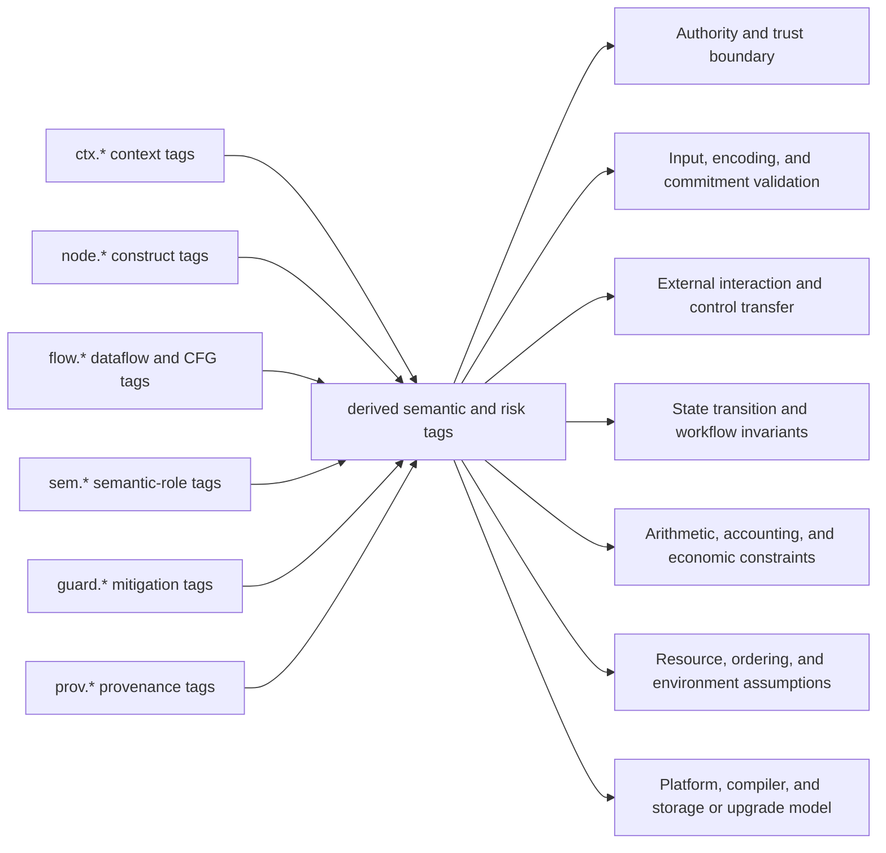
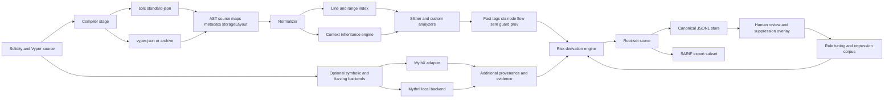

# Designing a Line-Level Root-Cause Tagging System for Smart Contract Codebases

## Executive summary

A robust line-level labeling system for smart-contract code should not start from hundreds of vulnerability names. It should start from a **small, stable internal root-cause cover** and then map outward to external taxonomies such as OWASP SCWE, SWC/EIP-1470, EEA EthTrust, and CVE/NVD. That design choice is justified by the roles those artifacts actually play: SCWE is a maintained smart-contract weakness enumeration intended as a complement to CWE and a bridge between OWASP SCSVS and SCSTG; EIP-1470 defines SWC as a smart-contract-specific weakness classification loosely aligned to CWE; the live SWC registry explicitly warns that it is no longer actively maintained and may contain omissions; EthTrust provides a certification-oriented specification and checklist; and CVE/NVD provide real-world disclosed vulnerability identifiers, affected-version context, and severity metadata rather than a root-cause ontology.

The most practical architecture is a **two-layer model**. Layer one is a proposed seven-set semantic cover over all executable lines: **authority and trust boundary**, **input/encoding/commitment validation**, **external interaction and control transfer**, **state transition and workflow invariants**, **arithmetic/accounting/economic constraints**, **resource/ordering/environment assumptions**, and **platform/compiler/storage/upgrade model**. Layer two is a **composable tag ontology** that records concrete evidence: AST constructs, dataflow, control-flow, compiler versions, storage layout context, cryptographic operations, access-control checks, upgradeability mechanics, gas and liveness signals, and mitigations. This separation lets the internal model stay stable while still interoperating with evolving external standards and newly disclosed CVEs. That stability goal is also consistent with academic work such as OpenSCV, which argues that earlier schemes such as SWC had become heterogeneous or outdated as the ecosystem evolved.

For implementation, the strongest foundation is compiler-native provenance. Solidity’s compiler can emit ASTs, storage layout, metadata, and bytecode source maps; source mappings exist both at AST level and bytecode-instruction level. Vyper can emit ASTs, source maps, storage layout, JSON compilation outputs, and reproducible archive artifacts with version and integrity information. Slither adds source-located detectors, a custom detector API, Vyper support, and a SlithIR SSA-based representation suitable for dataflow and taint analysis. MythX adds static analysis, symbolic analysis, and greybox fuzzing and associates locations with SWC IDs, while Mythril provides local symbolic execution but explicitly does not cover business-logic errors soundly.

Persist the **full per-line inventory** in a canonical JSONL store, and publish only the **review-worthy subset** in SARIF. GitHub’s SARIF ingestion is useful for CI and pull requests, but it expects SARIF 2.1.0, relies on stable locations and `partialFingerprints` to deduplicate results across runs, and enforces practical limits on uploaded result counts. That makes SARIF an interchange/reporting format, not the canonical storage format for “every executable line.” Keep raw line tags, derived set scores, provenance, suppressions, and diff history in JSONL or a database; export only suspicious, high-priority, or changed findings into SARIF.

Finally, treat **version and dependency context as first-class evidence**, not as metadata garnish. Real NVD records for Vyper and OpenZeppelin show that compiler versions, library versions, code-generation bugs, signature validation assumptions, duplicated delegatecalls, governance frontrunning, ERC2771 caller reconstruction, and financial accounting defects can all be version-specific. A useful root-cause tagging system therefore needs build-aware contextual tags on affected lines, not just syntax-based detectors.

## Taxonomy foundation and the seven root-cause sets

Before defining the seven sets, it helps to clarify what each external source contributes to the design.

| Framework | What it is | Best use in this system |
|---|---|---|
| **OWASP SCWE** | A maintained list of common security and privacy weaknesses in smart contracts; OWASP describes it as complementary to CWE and as a bridge between SCSVS and SCSTG. It distinguishes **weaknesses** from **vulnerabilities** and organizes entries by SCSVS controls. | Use as a maintained weakness vocabulary and as a source of example mappings and mitigations. |
| **SWC / EIP-1470** | EIP-1470 defines SWC as a smart-contract-specific weakness classification scheme loosely aligned to CWE and intended to create a common language across developers, tools, and auditors. The live SWC registry warns that it has not been thoroughly updated since 2020 and may contain errors and omissions. | Use for backward compatibility, legacy test cases, and interop with older tools and audit reports. |
| **EEA EthTrust** | A certification-oriented specification and companion checklist; the March 2025 checklist says the checklist is a convenience document and the specification is authoritative. EthTrust certification is explicitly framed as a claim that tested code is not vulnerable to a number of known attacks or failures to operate as expected, not as a blanket security guarantee. | Use as a normative requirements layer, especially for compiler/version policy, external calls, access control, and upgrade governance. |
| **CVE / NVD** | The CVE program identifies, defines, and catalogs publicly disclosed vulnerabilities, while NVD is NIST’s standards-based vulnerability management repository and enrichment layer. CVE IDs uniquely identify vulnerabilities and NVD adds affected-version information, references, and metrics. | Use as empirical evidence for real-world exemplar mappings, affected-version tagging, and dependency/compiler risk context. |

The proposed internal model treats the codebase as a set of executable source-code lines after compiler source-map projection.

Let:

- $L_{exec}$ = all executable source-code lines in the analyzed codebase
- $R = \{R_{auth}, R_{validate}, R_{flow}, R_{state}, R_{value}, R_{env}, R_{platform}\}$

The design goal is:

- $R_i \subseteq L_{exec}$ for every root-cause set $R_i$
- $\bigcup_i R_i = L_{exec}$

This is a **cover**, not a partition. Lines may belong to multiple sets. That is necessary because major smart-contract failures are often multi-causal. Reentrancy, for example, is both an **external interaction/control-transfer** problem and a **state-transition sequencing** problem; `delegatecall` can be both a **control-transfer** issue and a **platform/upgrade/storage-context** issue. Solidity’s own security documentation and EthTrust’s checks-effects-interactions requirements make that multi-causal structure explicit.

The seven proposed root-cause sets are as follows.

| Root-cause set | Semantic question the line answers | Typical tagged lines | Representative external alignment |
|---|---|---|---|
| **Authority and trust boundary** | *Who is allowed to do this, and under which trust assumptions?* | Caller checks, role checks, upgrade authorization, pause/unpause, selfdestruct authorization, meta-tx caller reconstruction | SCWE-016 and SCWE-018 cover insufficient authorization and `tx.origin`; SWC-115 and SWC-106 cover `tx.origin` authorization and unprotected selfdestruct; EthTrust includes **No `tx.origin`** and **Enforce Least Privilege**; NVD CVE-2023-40014 shows caller-identity reconstruction failure in `ERC2771Context`. |
| **Input, encoding, and commitment validation** | *Are bytes, parameters, hashes, signatures, nonces, lengths, domains, and critical addresses valid and unambiguous?* | Zero-address checks, calldata/returndata length checks, `abi.decode`, EIP-712 domain checks, nonce checks, replay-protection logic, `abi.encodePacked` on dynamic inputs | SCWE-022, SCWE-074, SCWE-120, SCWE-122, and SCWE-143 address replay, hash collisions, return-data length, calldata length, and critical address validation; SWC-121, SWC-117, and SWC-133 cover replay, malleability, and packed-encoding collisions; CVE-2022-31172 shows a real signature-validation assumption failure. |
| **External interaction and control transfer** | *Does control leave the contract or trust boundary safely, and are failure modes handled correctly?* | Low-level calls, `delegatecall`, `staticcall`, ETH/token transfers, callback surfaces, external call-return handling | SCWE-046, SCWE-048, and SCWE-134 cover reentrancy, unchecked call return, and low-level calls to non-contract addresses; SWC-104, SWC-107, and SWC-112 cover unchecked calls, reentrancy, and delegatecall to untrusted callees; EthTrust requires low-level returns to be checked and uses CEI to protect against reentrancy. |
| **State transition and workflow invariants** | *Are state changes sequenced correctly and do workflow invariants hold before, during, and after execution?* | Effect ordering, stale reads, accounting synchronization, governance action construction, duplicate execution, invariant assertions | SCWE-137 highlights read-only reentrancy via stale view state; SCWE-052 and SCWE-037 capture order dependence and front-running; CVE-2023-30542 and CVE-2023-49798 are concrete workflow/invariant failures in governance and multicall execution. |
| **Arithmetic, accounting, and economic constraints** | *Do numeric and economic invariants hold under overflow, truncation, price movement, and accounting updates?* | Balance/supply/debt updates, rounding logic, share-price math, slippage bounds, caps, min/max checks | SCWE-047 covers integer overflow/underflow; SCWE-124 covers inconsistent rounding in financial math; SCWE-090 covers missing slippage protection; SWC-101 covers overflow/underflow; EthTrust includes overflow and rounding requirements; NVD CVE-2023-26488 is a concrete accounting inconsistency. |
| **Resource, ordering, and environment assumptions** | *Are gas, liveness, timestamps, ordering, randomness, and validator-controlled environment inputs being used safely?* | Unbounded loops, timestamp-sensitive branches, `blockhash`/`prevrandao` randomness, frontrunnable governance or pricing, deadline checks | Solidity warns that unbounded loops can stall contracts; SCWE-024, SCWE-052, SCWE-077, SCWE-084, SCWE-141, and SCWE-153 cover weak randomness, order dependence, rate limiting, blockhash misuse, deadlines, and `prevrandao`; MythX also detects timestamp and environment-variable influence on control flow and unbounded loops; NVD CVE-2023-34234 is a real frontrunning case. |
| **Platform, compiler, and storage or upgrade model** | *Does the platform’s actual execution model preserve the developer’s intent across compiler, storage, library, and proxy semantics?* | Compiler-version context, inline assembly/Yul, proxy upgrade lines, storage-layout-sensitive code, known-bug trigger patterns, dependency-version-sensitive paths | SCWE-039, SCWE-061, SCWE-089, SCWE-099, and SCWE-150 cover inline assembly, outdated compiler versions, outdated libraries, and storage layout collisions; Solidity publishes a machine-readable known-bugs list and compiler metadata; EthTrust heavily emphasizes modern compilers and compiler bugs; Vyper versioning explicitly calls out security fixes; NVD records for Vyper and OpenZeppelin show real compiler/library semantics failures. |

The reason to use these seven sets instead of directly tagging lines with SCWE or SWC IDs is that external taxonomies are too fine-grained and too unstable to be the **primary semantic layer**. OpenSCV’s critique of older schemes, together with the SWC registry’s own stale-maintenance warning, strongly suggests that a production system should keep a small internal root layer and treat SCWE, SWC, EthTrust, and CVE as **mapping targets and evidence vocabularies**, not as the universal semantic substrate.

## Tag ontology and tag-to-set mapping rules

The ontology should be **structured**, **composable**, and **provenance-rich**. A flat label list is not expressive enough for line-level reasoning because the same line may simultaneously carry construct information, dataflow evidence, mitigation evidence, platform context, and one or more derived root-cause memberships.

A practical schema uses eight tag families.

| Tag family | Purpose | Example | Value form | Cardinality per line |
|---|---|---|---|---|
| `ctx.*` | Inherited build and environment context | `ctx.compiler.solc=0.8.24`, `ctx.proxy.pattern=uups` | parametric | one or more |
| `node.*` | Direct AST/IR construct facts | `node.call.kind=delegatecall` | enum or boolean | one or more |
| `flow.*` | Dataflow, taint, dominance, and call-graph relations | `flow.user_input_to_call_target=true` | boolean or relation | zero or more |
| `sem.*` | Operational semantics or business role of the line | `sem.state.balance_write=true` | boolean or enum | one or more for executable lines |
| `guard.*` | Positive mitigations and hardening controls | `guard.flow.nonreentrant=present` | enum | zero or more |
| `risk.*` | Derived hazard hypotheses | `risk.env.unbounded_loop=true` | boolean or scored enum | zero or more |
| `prov.*` | Evidence provenance | `prov.slither.detector=reentrancy-eth` | parametric | one or more |
| `root.*` | Final root-set membership and score | `root.flow=0.97` | score in $[0,1]$ | exactly one primary, optional secondary |

Use **lowercase dot-separated namespaces** and prefer **parameterized values** over exploding the namespace into many near-duplicates. For example, `guard.sig.replay_protection=nonce+domain` is better than creating separate ad hoc tags for every replay-protection combination. Likewise, `ctx.dependency.openzeppelin.contracts=4.9.4` is better than inventing a separate tag name for each affected version. This also matches the way Solidity metadata, EthTrust conformance context, and Vyper archives expose versioned build information as structured data rather than free text.

Boolean tags are appropriate for crisp predicates such as “line contains a low-level call.” Parametric tags are preferable for versions, roles, slots, gas modes, proxy patterns, trust levels, and replay-protection strength. The line record should therefore support:

- **boolean values** for direct facts
- **enums** for controlled categorical values
- **numbers/ranges** for versions, line spans, gas, and slot indices
- **relations** for taint/control-flow edges
- **scores** for derived root-set confidence

The tag-to-set relation is best modeled as a two-step derivation:

1. **facts → derived risk or semantic tags**
2. **derived tags → one or more root-cause sets**

That keeps the system explainable. The line should show not only that it maps to `R_flow`, but *why*: for example, because it is a low-level external call, its target is tainted from external input, and its return value is unchecked.



A good rule engine uses both deterministic mappings and heuristics.

| Rule class | Example | Determinism | Suggested confidence |
|---|---|---|---|
| **Exact syntax** | `node.call.kind=delegatecall` | deterministic | 0.95–1.00 |
| **Compiler-known-bug trigger** | build version in affected range **and** bug predicate satisfied | deterministic | 1.00 |
| **Intra-procedural CFG** | state write dominated by external call and not by reentrancy guard | near-deterministic | 0.85–0.95 |
| **Inter-procedural taint** | user-controlled address reaches call target or auth predicate | heuristic but strong | 0.75–0.90 |
| **Semantic-context inheritance** | line is inside a proxy upgrade path or replay-protected permit path | heuristic/contextual | 0.60–0.85 |
| **Fallback parent inheritance** | line has no direct evidence, inherit dominant set from smallest executable AST parent | coverage heuristic | 0.35–0.60 |

A simple, explainable scoring function is:

$$
score(r, l)=1-\prod_{e \in E(r,l)}(1-w_e)
$$

where $E(r,l)$ is the set of evidence items supporting root set $r$ on line $l$, and $w_e$ is the evidence weight. The line gets one **primary** root set $argmax_r score(r,l)$ and any **secondary** sets above a threshold. This makes the system mathematically total while keeping the UI interpretable.

The most important mapping principle is **coverage without overconfidence**. Because the user requirement is to label **every executable line**, each executable line should get at least one primary set even when it is not presently vulnerable. In other words, the system tags the line’s **security responsibility domain**, not just exploitable defects. A benign `require(msg.sender == owner)` line still belongs to **authority**; a safe balance update still belongs to **state** and often **value**; a guarded external call still belongs to **flow**. This is the cleanest way to ensure $\bigcup_i R_i = L_{exec}$ without pretending that every line is a finding.

## Per-line analysis model and automation architecture

The line-level model should be compiler-faithful. For Solidity, the compiler provides AST source ranges and bytecode-to-source mappings; AST mappings use the compact `s:l:f` form, while bytecode source maps use compressed `s:l:f:j:m` instruction-level entries. The standard JSON compiler interface can emit AST, metadata, storage layout, and source maps in one reproducible build. Solidity also publishes machine-readable known-bug data with affected version ranges and triggering conditions. For Vyper, the compiler can emit AST, source maps, storage layout, and JSON output, while Vyper archives include compiler version, settings, integrity, and optional storage layout overrides. Vyper also emphasizes security, auditability, bounded loops, no recursion, and built-in reentrancy protection through `@nonreentrant`.

That leads to the following per-line evidence model.

| Signal family | What to extract | Preferred source | Dominant root sets |
|---|---|---|---|
| **AST and source-span facts** | call kind, modifiers, assertions, loops, arithmetic ops, `abi.decode`, `ecrecover`, `selfdestruct`, assembly blocks | `solc` AST and source maps; Vyper AST and source maps | all, especially validation, value, platform |
| **IR and dataflow** | sources of taint, sinks, SSA defs/uses, user input to auth, amount, call target, storage write | Slither and SlithIR; custom Vyper-normalized IR | authority, validation, flow, value |
| **CFG and dominance** | call-before-write sequencing, guard coverage, reentrancy surfaces, stale read patterns, liveness paths | Slither CFG; custom passes | flow, state, environment |
| **Compiler and dependency context** | compiler version, optimizer/edit mode, known-bug ranges, dependency versions, metadata hash | Solidity metadata and bugs list; Vyper versioning and archives; lockfiles | platform |
| **External-call semantics** | low-level call kind, value transfer, return handling, target trust level, callback surfaces | AST, IR, detectors, ABIs | flow |
| **Storage and upgradeability** | proxy pattern, storage layout, slot overlap risk, storage gap usage, upgrade function context | `storageLayout`, Vyper layout, proxy recognizers | platform, state |
| **Access control** | role checks, owner checks, `_msgSender()`, meta-tx context, timelocks, multisig-sensitive operations | AST, call graph, inherited context | authority |
| **Cryptography and commitments** | EIP-712 domain separation, nonce use, signature recover flow, `abi.encodePacked`, VRF callback validation | AST, taint, semantic passes | validation |
| **Gas, liveness, and ordering** | unbounded loops, gas forwarding, timestamp branches, block randomness, order-sensitive governance/pricing | AST, CFG, taint, detectors | environment |
| **Proof or invariant signals** | `assert`, proof targets, discharged invariants, counterexamples | Solidity SMTChecker | state, value |

Slither is especially useful here because it identifies source locations, supports Solidity and Vyper, integrates with CI and Hardhat/Foundry-oriented builds, and exposes a detector API on top of its IR. The Slither paper also explicitly calls out SSA form, dataflow, and taint tracking as core capabilities. MythX complements this with static analysis, symbolic analysis, and greybox fuzzing when an API-backed service is acceptable. Mythril is a good local symbolic-execution fallback, but its own documentation says it is targeted at common vulnerabilities and does not discover business-logic problems soundly, so it should be treated as an optional evidence source rather than the sole truth.



A few implementation caveats matter:

- Solidity bytecode source maps are **instruction-level**, not byte-level; the mapper must understand that a `PUSH` spans multiple bytes but a single source-map entry.
- Source maps may point to compiler-generated or internal sources using file id `-1`, and Solidity explicitly warns that `verbatim` can invalidate source mappings; the system should mark those cases as **synthetic or reduced-fidelity evidence**, not silently project them onto arbitrary user lines.
- Vyper should get **language-default contextual tags**. Because Vyper excludes inheritance, modifiers, inline assembly, recursion, and unbounded loops by design, those tags should often be marked `impossible-by-language` or `not-applicable` instead of merely absent. At the same time, Vyper’s `raw_call`, compiler-version changes, storage layout overrides, and callback semantics still require first-class tagging.

For CI, use an **incremental multi-speed pipeline**:

- a **fast changed-files pass** on every push
- a **PR gating pass** on changed functions plus impact-expanded callers/callees
- a **nightly full pass** over the whole repository plus benchmarks and historical CVE regressions

This lets the system remain useful on large repos while still supporting the universal line-label objective.

## Persistence, provenance, validation, and storage formats

The canonical persistence format should be **JSONL**, with one record per executable line or per canonical executable range projected onto a line. SARIF should be treated as an **export layer** for review workflows, IDEs, and code scanning. That recommendation is grounded in both structure and scale: GitHub only supports SARIF 2.1.0 for code scanning, uses `partialFingerprints` to suppress duplicates across runs, depends on stable physical locations, and enforces practical limits on results per run. In contrast, a full “every executable line” labeling inventory can easily exceed what code-scanning UIs are designed to show. SARIF’s schema and GitHub’s ingestion model do support additional metadata through property bags and location structures, which makes SARIF a good **projection** of the JSONL truth store.

A good JSONL record should carry at least:

- repository, commit, and artifact identity
- file path, line number, and optional column/range
- language and compiler/dependency context
- raw tags
- derived root-set scores
- provenance and evidence sources
- review and suppression overlay references
- stable fingerprints for diff matching

A concise sample JSON Schema is below.

```json
{
 "$schema": "https://json-schema.org/draft/2020-12/schema",
 "title": "sc-line-tag-record",
 "type": "object",
 "required": [
 "repo",
 "commit",
 "artifact",
 "location",
 "language",
 "tags",
 "rootSets",
 "rootScores",
 "provenance"
 ],
 "properties": {
 "repo": { "type": "string" },
 "commit": { "type": "string" },
 "artifact": {
 "type": "object",
 "required": ["path", "sha256"],
 "properties": {
 "path": { "type": "string" },
 "sha256": { "type": "string" },
 "role": { "type": "string", "enum": ["first_party", "dependency", "generated"] }
 }
 },
 "location": {
 "type": "object",
 "required": ["startLine", "endLine"],
 "properties": {
 "startLine": { "type": "integer", "minimum": 1 },
 "endLine": { "type": "integer", "minimum": 1 },
 "startColumn": { "type": "integer", "minimum": 1 },
 "endColumn": { "type": "integer", "minimum": 1 },
 "astNodeIds": {
 "type": "array",
 "items": { "type": "integer" }
 }
 }
 },
 "language": { "type": "string", "enum": ["solidity", "vyper"] },
 "buildContext": {
 "type": "object",
 "properties": {
 "compiler": { "type": "string" },
 "compilerVersion": { "type": "string" },
 "evmVersion": { "type": "string" },
 "optimizer": { "type": "boolean" },
 "proxyPattern": { "type": "string" }
 }
 },
 "tags": {
 "type": "array",
 "items": {
 "type": "object",
 "required": ["name", "family", "value"],
 "properties": {
 "name": { "type": "string" },
 "family": { "type": "string" },
 "value": {},
 "confidence": { "type": "number", "minimum": 0, "maximum": 1 }
 }
 }
 },
 "rootSets": {
 "type": "array",
 "items": {
 "type": "string",
 "enum": [
 "AUTH",
 "VALIDATE",
 "FLOW",
 "STATE",
 "VALUE",
 "ENV",
 "PLATFORM"
 ]
 }
 },
 "rootScores": {
 "type": "object",
 "properties": {
 "AUTH": { "type": "number", "minimum": 0, "maximum": 1 },
 "VALIDATE": { "type": "number", "minimum": 0, "maximum": 1 },
 "FLOW": { "type": "number", "minimum": 0, "maximum": 1 },
 "STATE": { "type": "number", "minimum": 0, "maximum": 1 },
 "VALUE": { "type": "number", "minimum": 0, "maximum": 1 },
 "ENV": { "type": "number", "minimum": 0, "maximum": 1 },
 "PLATFORM": { "type": "number", "minimum": 0, "maximum": 1 }
 }
 },
 "fingerprints": {
 "type": "object",
 "properties": {
 "lineFingerprint": { "type": "string" },
 "statementFingerprint": { "type": "string" },
 "functionFingerprint": { "type": "string" }
 }
 },
 "provenance": {
 "type": "array",
 "items": {
 "type": "object",
 "required": ["source", "kind"],
 "properties": {
 "source": { "type": "string" },
 "kind": { "type": "string" },
 "rule": { "type": "string" },
 "evidenceRef": { "type": "string" }
 }
 }
 },
 "review": {
 "type": "object",
 "properties": {
 "status": {
 "type": "string",
 "enum": ["unreviewed", "accepted", "suppressed", "waived", "fixed"]
 },
 "rationale": { "type": "string" },
 "expiresAt": { "type": "string", "format": "date-time" }
 }
 }
 }
}
```

For SARIF export, keep the normal SARIF `locations` and `physicalLocation` data for the line/range, put rule metadata in the standard rule objects, and attach the tag inventory and root-set scores under a custom property namespace such as `sc.*`. Also emit `partialFingerprints` for stable deduplication across commits, because GitHub explicitly uses them to decide when two results are logically identical.

The persistence strategy should also handle provenance and reviewer overlays explicitly.

| Concern | Recommended design |
|---|---|
| **Location identity** | Store both line and canonical span. Use file hash, AST path, nearest function signature, and normalized statement text to build stable fingerprints. |
| **Version provenance** | Persist compiler version, compiler settings, EVM target, dependency versions, metadata hash, and analyzer versions. EthTrust requires compiler options and metadata in conformance claims; Solidity metadata and Vyper archives already expose the needed fields. |
| **Diff handling** | Recompute only changed files and affected functions, but keep cross-commit result identity via line and statement fingerprints plus `partialFingerprints` in SARIF export. |
| **False-positive management** | Never overwrite raw analyzer output. Layer a reviewer overlay keyed by fingerprint and taxonomy version, with expiry dates for suppressions and mandatory rationale. |
| **Language specificity** | Mark impossible or not-applicable tags explicitly for language-constrained cases, especially in Vyper. |
| **Generated or low-fidelity mappings** | Use a `coverageMode` such as `exact`, `derived`, `inherited`, or `synthetic` to distinguish trustworthy labels from inherited or compiler-generated projections. |

Validation should be both **benchmark-driven** and **human-reviewed**. SmartBugs is valuable because its paper describes a precision dataset with 143 annotated vulnerable contracts and 208 tagged vulnerabilities, plus a much larger real-world dataset. G-Scan is valuable because it shows that line-level localization is feasible and reports strong F1 on line-level reentrancy localization. At the same time, MythX and Mythril both make clear that automation does not remove the need for human review, especially for business logic.

A rigorous evaluation plan should therefore measure at least four layers:

| Metric family | What to measure |
|---|---|
| **Tag quality** | precision, recall, and F1 for individual tags |
| **Root-set quality** | macro/micro F1 for the seven sets; primary-set exact match accuracy |
| **Localization quality** | exact-line match, line-window recall, and span overlap |
| **Operational quality** | reviewer acceptance rate, suppression rate, calibration of confidence scores, and analysis latency per PR |

A strong human-in-the-loop workflow is:

1. analyzer emits provisional line tags and root-set scores
2. reviewer triages only lines above risk or uncertainty thresholds
3. disagreements are adjudicated into a gold corpus
4. rules and score thresholds are tuned against the adjudicated set
5. nightly regressions run on CVE repros, SmartBugs, and internal historical findings

## Prioritized tags, annotated examples, roadmap, and source priorities

The following thirty tags are the best starting set for a prototype because they cover the highest-value semantic surfaces across Solidity and Vyper/EVM while remaining composable.

| Tag | Primary set | Secondary set | Short definition | Example pattern |
|---|---|---|---|---|
| `sem.auth.role_check` | AUTH | — | Caller is checked against owner, role, or ACL | `require(hasRole(X, msg.sender))` |
| `risk.auth.tx_origin` | AUTH | — | Authorization depends on `tx.origin` | `require(tx.origin == owner)` |
| `sem.auth.privileged_operation` | AUTH | PLATFORM | Line performs upgrade, pause, mint, sweep, or destructive admin action | `_upgradeTo(newImpl)` |
| `ctx.auth.meta_tx` | AUTH | VALIDATE | Caller identity comes from a forwarder-aware context | `_msgSender()` |
| `guard.auth.timelock` | AUTH | ENV | Sensitive action requires delay window | `require(block.timestamp >= eta)` |
| `guard.input.zero_address` | VALIDATE | AUTH | Critical address is validated against zero address | `require(to != address(0))` |
| `guard.input.length_check` | VALIDATE | FLOW | Bytes or returndata length is checked | `require(data.length >= 4)` |
| `sem.abi.decode_user_bytes` | VALIDATE | — | User-controlled bytes are decoded | `abi.decode(payload, (...))` |
| `risk.hash.encode_packed_dynamic` | VALIDATE | AUTH | Ambiguous hashing over multiple dynamic values | `keccak256(abi.encodePacked(a, b))` |
| `guard.sig.replay_protection` | VALIDATE | AUTH | Nonce, domain separator, or used-hash replay guard exists | `require(!used[digest])` |
| `sem.call.low_level` | FLOW | — | Low-level external interaction is used | `.call(...)`, `raw_call(...)` |
| `sem.call.delegatecall` | FLOW | PLATFORM | Execution context is delegated to external code | `delegatecall(data)` |
| `flow.user_input_to_call_target` | FLOW | AUTH | External input can influence call destination | `target.call(data)` |
| `sem.call.value_transfer` | FLOW | VALUE | The external interaction transfers ETH/value | `.call{value: amt}("")` |
| `risk.call.unchecked_return` | FLOW | STATE | External result is ignored or weakly handled | `callee.call(data);` |
| `guard.flow.nonreentrant` | FLOW | STATE | Reentrancy guard is present | `nonReentrant`, `@nonreentrant` |
| `risk.flow.state_write_after_call` | FLOW | STATE | Shared state is updated after a call-out | write after `.call(...)` |
| `sem.state.balance_write` | STATE | VALUE | Line mutates balances, supply, debt, allowances, or shares | `balances[to] += amt` |
| `guard.state.invariant_check` | STATE | VALUE | Invariant is asserted or required | `assert(total <= cap)` |
| `risk.state.stale_view_dependency` | STATE | FLOW | Line participates in stale-read or read-only reentrancy pattern | value read before pending effect settles |
| `risk.math.unchecked` | VALUE | PLATFORM | Wrapping arithmetic or unsafe cast path exists | `unchecked { total += x; }` |
| `risk.math.rounding_value_sensitive` | VALUE | STATE | Rounding direction can change economic outcome | share/asset math with division |
| `guard.value.slippage_bound` | VALUE | ENV | Economic tolerance or min/max bound exists | `require(amountOut >= minOut)` |
| `risk.env.unbounded_loop` | ENV | FLOW | Loop bound depends on user or storage growth | `for(i; i < users.length; ++i)` |
| `risk.env.timestamp_sensitive` | ENV | AUTH | Value-sensitive or authorization-sensitive logic uses timestamp | `if(block.timestamp > expiry)` |
| `risk.env.chain_randomness` | ENV | VALIDATE | Randomness depends on validator-controlled chain data | `blockhash`, `prevrandao` |
| `risk.env.tod_sensitive` | ENV | STATE | Line participates in transaction-order-dependent behavior | frontrunnable proposal or price path |
| `ctx.compiler.version_risky` | PLATFORM | — | Current build version falls in risky or floating range | affected compiler or pragma context |
| `ctx.storage.proxy_layout_sensitive` | PLATFORM | STATE | Line executes in proxy/shared-storage context | upgrade or proxy-sensitive function |
| `ctx.platform.inline_assembly` | PLATFORM | VALIDATE | Line is inside `assembly {}` or Yul-sensitive path | `assembly { sstore(...) }` |

Some of those tags are more useful when treated as **parametric** rather than merely present or absent. For example:

- `guard.sig.replay_protection = none | nonce | nonce+domain | nonce+domain+usedhash`
- `ctx.proxy.pattern = none | transparent | uups | beacon | minimal`
- `ctx.compiler.version_risky = none | floating | outdated | known_bug_match`
- `risk.env.timestamp_sensitive = low | medium | high`
- `flow.user_input_to_call_target = direct | indirect_storage | role_gated`

The tag-to-set mapping table for those thirty tags is summarized below.

| Tag group | Maps to root sets |
|---|---|
| `sem.auth.*`, `risk.auth.*`, `guard.auth.*` | AUTH primarily |
| `guard.input.*`, `sem.abi.*`, `risk.hash.*`, `guard.sig.*` | VALIDATE primarily |
| `sem.call.*`, `risk.call.*`, `guard.flow.*`, `flow.*` with call sink | FLOW primarily |
| `sem.state.*`, `guard.state.*`, `risk.state.*` | STATE primarily |
| `risk.math.*`, `guard.value.*`, `sem.state.balance_write` | VALUE primarily |
| `risk.env.*`, timestamp/randomness/order/loop tags | ENV primarily |
| `ctx.compiler.*`, `ctx.storage.*`, `ctx.platform.*`, assembly or compiler-known-bug tags | PLATFORM primarily |

A few short annotated examples show how multi-label line mapping should work.

| ID | Language | Snippet fragment | Key tags | Root sets | Comment |
|---|---|---|---|---|---|
| A | Solidity | `require(tx.origin == owner);` | `risk.auth.tx_origin`, `sem.auth.role_check` | AUTH | Direct caller-auth bug surface |
| B | Solidity | `(bool ok,) = msg.sender.call{value: share}("");` | `sem.call.low_level`, `sem.call.value_transfer` | FLOW, VALUE | External interaction owns the line semantics |
| C | Solidity | `shares[msg.sender] = 0;` **after** B | `risk.flow.state_write_after_call`, `sem.state.balance_write` | STATE, FLOW, VALUE | Same vulnerability family, different causal line |
| D | Solidity | `bytes32 h = keccak256(abi.encodePacked(admins, users));` | `risk.hash.encode_packed_dynamic` | VALIDATE, AUTH | Ambiguous commitment affecting authorization |
| E | Vyper | `success: bool = raw_call(target, payload, revert_on_failure=False)` | `sem.call.low_level`, `risk.call.unchecked_return` if `success` unused | FLOW | Vyper-specific call form |
| F | Solidity | `_upgradeToAndCall(newImpl, data);` | `sem.auth.privileged_operation`, `ctx.storage.proxy_layout_sensitive` | AUTH, PLATFORM, STATE | Upgrade lines inherit storage/proxy context |

The recommended prototype roadmap is three phases.

| Phase | Scope | Estimated duration | Main deliverables |
|---|---|---|---|
| **Foundation** | Compiler normalization, executable-line indexing, initial ontology, JSONL store, first 12–15 deterministic tags | **3–4 weeks** | Solidity and Vyper ingestion, AST/source-map projection, initial root-set scorer |
| **Signal fusion** | Slither integration, CFG and taint passes, compiler/dependency risk context, SARIF subset export, top-30 tag coverage | **4–6 weeks** | CI-ready engine with provenance, fingerprints, suppressions, and score explanations |
| **Validation and tuning** | SmartBugs/SWC/CVE regression corpus, reviewer UI or workflow, calibration, false-positive reduction, policy gates | **3–5 weeks** | Benchmark report, threshold tuning, review playbook, rollout criteria |

The highest-priority sources to consult and operationalize are these.

| Source family | Why it matters |
|---|---|
| **OWASP SCWE and SCSVS** | SCWE is maintained, explicitly distinguishes weaknesses from vulnerabilities, and is designed to bridge SCSVS and SCSTG; it is the best maintained weakness vocabulary for mapping examples and mitigations. |
| **SWC registry and EIP-1470** | Still widely referenced by tools and reports; EIP-1470 explains the SWC conceptual model and test-case purpose, even though the registry is stale. |
| **EEA EthTrust specification and checklist** | Best normative source for version-aware requirements, external calls, compiler policy, least privilege, and certification-style review criteria. |
| **NVD/CVE records for compilers and libraries** | Necessary for version-aware context tags and regression tests grounded in real incidents. Vyper and OpenZeppelin CVEs are especially valuable. |
| **Solidity docs** | Essential for source maps, standard-json outputs, metadata, known compiler bugs, security considerations, storage layout, and SMTChecker. |
| **Vyper docs** | Essential for source maps, layout, JSON interface, archives, integrity, bounded loops, `@nonreentrant`, and release/versioning policy. |
| **Slither docs and paper** | Best open frontend for AST/IR/dataflow/taint with CI integration, custom detectors, source locations, and Vyper support. |
| **MythX and Mythril docs** | Useful for optional symbolic/fuzzing evidence and for understanding the limits of generic automation on business logic. |
| **SmartBugs and G-Scan** | SmartBugs is a practical evaluation corpus; G-Scan is strong evidence that line-level localization is achievable and measurable. |
| **OpenSCV** | Helpful intellectual support for why an internal stable root-cause layer should be separated from external vulnerability catalogs. |

**Open questions and limitations.** This report specifies the design for **Solidity and Vyper on the EVM**. Other smart-contract ecosystems and languages are intentionally left unspecified. It also assumes that per-line labeling is a **security-semantic responsibility model** rather than a claim that each labeled line is exploitable. That distinction is important, because SCWE itself also distinguishes weaknesses from vulnerabilities, and real-world tools such as MythX and Mythril explicitly do not eliminate the need for human review on business logic.